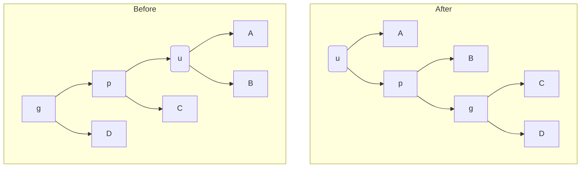
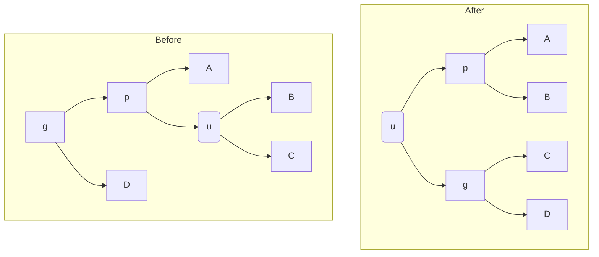
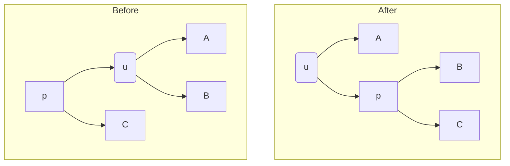

## 定义

在平摊分析中，势能法是一种重要的方法。我们将对数据结构的修改看作“做功”，做功会导致数据结构的势能改变。从技术上来说，对于数据结构 $D$，如果能够定义势能函数 $\Phi(D)$ 并给出一次操作时间开销和势能变化总和的上界：

<!-- more -->
$$
\hat{c} = T_i - \Delta\Phi \le A_i
$$
其中 $T_i$ 是操作时间，$\Delta\Phi$ 是势能变化量即 $\Phi(D')-\Phi(D)$，$\hat{c}$ 称为**平摊开销**。那么，对两侧求和便得到：
$$
\sum_i T_i + \Phi_0 - \Phi \le \sum_i A_i
$$
就有
$$
\sum_{i} T_i \le \sum_{i} A_i + \Phi -\Phi_0 \le \sum_{i} A_i + \max \Phi-\Phi_0
$$

## 动态扩增数组问题

>  给定一个数组，其初始大小为 $1$，支持在数组末尾加入一个元素；如果数组元素已满，则将数组的大小翻倍，并付出线性于新数组长度的时间开销。求操作的平摊复杂度。

我们希望时间开销和势能变化的和有好的上界，因此当付出较大的时间代价时，我们希望势能的变化量也尽可能大。从物理的角度理解，”数组翻倍“这个做功的直接影响是使得数组的空闲区域变多，因此不妨定义势能函数为
$$
\Phi(D) = c\times 数组空闲位置个数
$$

那么当数组未满时的平摊开销就是
$$
\hat c = O(1) + c\times(\#empty - (\#empty - 1)) = O(1)
$$
当数组已满，需要翻倍时，不妨设原先数组长度为 $L$，那么
$$
\begin{aligned}
\hat c &= T_i + \Phi(D) - \Phi(D')\\
&= 2L + c - cL = O(1)
\end{aligned}
$$
因此，$n$ 次操作总的时间开销就是 
$$
\sum_i \hat c + \max \Phi - O(1)\le n\times O(1) + O(n) = O(n)
$$
换言之平摊时间开销就是 $O(n)/n = O(1)$，这便完成了分析。

## 替罪羊树

> 给定一个常数 $1/2 \le c < 1$，如果对于结点 $x$ 有 $|x.left|, |x.right| \le c|x|$，称结点 $x$ 是 $c$ 平衡的；如果二叉查找树的每一个节点都是 $c$ 平衡的，那么称这个二叉查找树是 $c$ 平衡的。很明显，我们可以在 $O(|x|)$ 的时间复杂度内将 $x$ 子树中所有结点变为 $1/2$ 平衡的，称这个过程为**重构**。
>
> - **插入：**将 $x$ 插入到树中，重构最高的非 $c$ 平衡结点
> - **删除：**将 $x$ 标记为删除，当一个子树中有超过一半元素标记为删除后，重构这个子树，并在重构的过程中去掉所有标为删除的结点。
>
> 当取 $1/2 <c <1$ 时我们称这样的结构为替罪羊树。

**定理：**替罪羊树操作均摊时间复杂度为 $O(\log n)$

**证明：**用归纳法容易证明对于 $1/2\le c < 1$，$c$ 平衡的树树高是 $O(\log n)$ 的，考虑如何分析插入和删除的时间复杂度。重构的契机有两种：树过于不平衡或者等待删除的结点过多，因此势能函数中应该体现这两点。不妨设 $\Delta(x) = ||x.left|-|x.right||$，$M(x)$ 表示子树 $x$ 中被标为删除的结点个数，定义势能函数为
$$
\Phi(D) = -k\times\left(M(root) + \sum_{|x|\ge 2}\Delta(x)\right)
$$
其中 $k$ 是一个用于抵消大 $O$ 隐含常数的常数。

容易发现，对于 $1/2$ 平衡的二叉查找树而言，由于左右孩子的大小不超过 $1$，其势函数 $\Phi(D) = -kM(root)$。

接下来考虑每个操作的平摊开销

1. **重构：**设重构的结点是 $x$，根据定义要么 $M(x)\ge |x|/2$，要么 $x$ 不是 $c$ 平衡的。第一种情况是容易的，因为重构一定可以降低 $\Phi$ 达 $|x|/2$。
   $$
   \begin{aligned}
   \hat c_1 &\le O(|x|) - k\left(M(x) + \sum_{x\ge 2}\Delta(x)\right) + k\left(0 + 0)\right) \\
   &\le O(|x|) - \frac{k|x|}{2}\\
   &=O(1)
   \end{aligned}
   $$
   第二种情况下，由于重构不会改变子树关系，因此
   $$
   \begin{aligned}
   \hat c &\le O(|x|) - k\left(M(x) + \sum_x\Delta(x)\right) + k\left(0+0\right)\\
   & \le O(|x|) + k\sum_{x\ge 2} \Delta(x)\\
   & \le O(|x|) + k\Delta(x)\\
   & \le O(|x|) + k((1-c)-c)\times|x|\\
   & \le O(|x|) + k(1-2c) |x|\\
   & = O(1)
   \end{aligned}
   $$
   最后一步是由于 $1-2c$ 是小于 $1$ 的常数，因此只需取合适的 $k$ 便可以抵消 $O(|x|)$ 的时间开销。

2. **插入：**由于树高是 $O(\log n)$ 的，插入一个结点仅会影响 $O(\log n)$ 个结点的 $\Delta(x)$，且不超过 $1$，因此平摊开销 $\hat c = O(\log n) + c\times O(\log n) = O(\log n)$

3. **删除：**由于树高是 $O(\log n)$ 的，且仅会增加一个删除结点，因此 $\hat c = O(\log n) + c\times O(1)=O(\log n)$

因此，插入和删除的时间复杂度都具有平摊上界
$$
T \le \hat c + \frac{1}{m}\max\Phi- O(1) = O(\log n)
$$

## 自组织表

> 考虑维护一个链表 $L$，支持以下操作：
>
> - 给定 $x$，从链表头 $L.head$ 开始依次查找直到找到 $x$，付出的时间代价是 $x$ 在链表中的排名 $rank_L(x)$
>
> 为了提高查找效率，链表可以做如下修改：
>
> - 给定两个相邻的元素 $x, y$，将他们交换，花费 $1$ 的时间代价
>
> 考虑如下的在线算法：每次访问一个元素时，就将其移动到开头，这样的策略称为 Move to Front（MTF）。

**定理：**MTF 算法的竞争比是 $4$。

**证明：**记 MTF 算法为 $M$，最优离线算法为 $OPT$，我们希望用势能函数表征 $M$ 维护的链表 $L_M$ 和最优链表 $L_O$ 之间的“距离”。我们用最小编辑距离（将 $L_M$ 变换到 $L_O$ 的最小操作次数）来表征这一点，根据排序算法的知识很容易知道，最小编辑距离正是**逆序对**的个数。如果用 $x<_L y$ 表示在序列 $L$ 中 $x$ 在 $y$ 左侧，那么
$$
\Phi = -c\big|\{(x, y) |x <_{L_M} y, y<_{L_O} x\}\big|
$$
接下来我们说明，MTF 算法的时间开销与最优算法的时间开销差距不会太大。设 $\#Inv$ 表示逆序对个数，$T_i$ 表示最优算法在这一次修改链表的次数，MTF 算法每次操作的平摊开销是
$$
\hat c \le 2\times rank_{L_M}(x) + c\times T_i + (-c\times \#Inv) + c\times \#Inv'
$$
其中第二项表示最优算法移动导致势能变化的上界，后两项的和取决于 MTF 操作新增的逆序对个数。设这次访问的元素为 $x$，将所有元素分为四类：

|                       | 在 $L$ 中 $x$ 的左侧 | 在 $L$ 中 $x$ 的右侧 |
| --------------------- | -------------------- | -------------------- |
| 在 $L'$ 中 $x$ 的左侧 | $A$                  | $B$                  |
| 在 $L'$ 中 $x$ 的右侧 | $C$                  | $D$                  |

那么，消减逆序对个数是 $|C|$，新增逆序对的个数是 $|A|$，那么上式也可以写成

$$
\hat c \le 2\times rank_{L_M}(x) + c\times T_i + c|A| - c|C|
$$
注意到 $|A| + |C| = rank(x)$，化简上面的式子
$$
\hat c \le 2\times rank_{L_M}(x) + c\times T_i + c\times (|A|-(rank(x) - |A|))
$$
因此：
$$
\hat c \le 2\times rank_{L_M}(x) + c\times T_i - c\times rank(x) + 2c|A|
$$
取 $c = 2$，注意到 $|A| + |B| = rank_{L_O}(x)$，就有
$$
\hat c \le 2T_i + 4|A| \le 2T_i + 4\times rank_{L_O}(x)\le 4(rank_{L_O}(x) + T_i)
$$
最后一项正是最优算法单次开销的 $4$ 倍，设操作序列为 $|S|$，就有
$$
C_{MTF} \le 4 C_{OPT} + \frac{1}{|S|}\max\Phi = 4C_{OPT}
$$
这便证明了 MTF 算法的竞争比是 $4$。

## 斜堆

> 斜堆是一种可并二叉堆，其维护一个满足堆性质的二叉树，并用合并完成插入、删除操作。其中，合并算法如下：
>
> - 不妨设合并的两个堆 $A.value < B.value$，递归合并 $A.right, B$，并在结束后交换 $A$ 的左右孩子

**定理：**斜堆的插入、删除、合并平摊复杂度为 $O(\log n)$

**证明：**设 $light(u)$ 表示 $u$ 的轻儿子，则
$$
\Phi = c[light(u) = u.right]
$$
在一次合并操作中，如果右儿子原先是重儿子，则之后右二子变为轻儿子，这带来了 $-c$ 的势能增加；如果右儿子原先是轻儿子，由于递归过程中经过的轻儿子总数是 $O(\log n)$ 的，因此一次合并的平摊代价为 $O(\log n)$。

由于插入操作和删除操作都仅包含 $O(1)$ 的时间和势能变化以及一次合并，因此所有操作的平摊时间复杂度都是 $O(\log n)$ 的。

## 伸展树

> 伸展树（Splay）是一种自适应二叉查找树，其特点是每当访问一个元素之后，就将其旋转到根。
>
> 旋转到根总是使用**双旋**操作。

**定理：**如果总是使用**双旋**操作旋转到根，访问 Splay 元素的均摊时间复杂度是 $O(\log n)$

**证明：**我们希望用势能函数的变化量抵消访问元素的时间开销。设 $|u|$ 为结点 $u$ 子树内部元素的大小，定义势能函数 $\Phi(T)$ 
$$
\Phi(T) = -c\times \sum_u w(u)
$$
其中 $w(u) = \log(|u|)$。我们将向下寻找结点的时间复杂度平摊在向上旋转的过程中，因此只需要考虑向上旋转的复杂度。

### Zig-Zig

设当前结点是 $u$，双旋的第一种情况如下图所示

操作前后的势能差为
$$
\begin{aligned}
\Phi - \Phi' = &-w(u) - w(p) - w(g)\\
&+ w'(u) + w'(p) + w'(g)\\
=& w'(p) + w'(g) - w(u) - w(p)\\
\le& 2[w'(u) - w(u)] + [w'(g) - w'(u)] + [w(u) - w(p)]\\
\end{aligned}
$$
设 $T$ 为上图所有点构成的树，注意到
$$
[w'(g) - w'(u)] + [w(u) - w(p)] \le c\log\frac{|C|+|D|+1}{|A|+|B|+|C|} + c\log\frac{|A|+|B|+1}{|A|+|B|+|C|}\le c\log\frac{1}{2} = -c
$$
因此
$$
\hat c = O(1) + \Phi - \Phi' \le 2[w'(u) - w(u)] + [O(1) - c] \le 2[w'(u)-w(u)]
$$

### Zig-Zag

势能变化量为
$$
\begin{aligned}
\Phi - \Phi' &= w'(p) + w'(g) - w(p) - w(u)\\
 &\le 2[w'(u) - w(u)] + [w'(p) - w'(u)] + [w'(g) - w'(u)]\\
 &\le 2[w'(u) - w(u)] - c
\end{aligned}
$$
因此平摊开销为
$$
\hat c = 2[w'(u) - w(u)] + O(1) - c \le 2[w'(u) - w(u)]
$$

### Zig

势能变化量为
$$
\Phi - \Phi' = w'(p) - w(u) \le w(p) = O(\log n)
$$
平摊开销为
$$
\hat c = O(1) + O(\log n) = O(\log n)
$$

### 访问开销

根据算法，一次访问包含一次 Zig 和多次 Zig-Zag、Zig-Zig，总的平摊开销为
$$
\hat c = \sum \hat c_i \le \sum2(\Phi'(u) - \Phi(u)) + O(\log n) \\
\le \Phi(root) + O(\log n) = O(\log n)
$$
因此平摊时间复杂度正是
$$
T \le \hat c + \frac{1}{m}\max\Phi = O(\log n)
$$
只需 $m\ge n$。